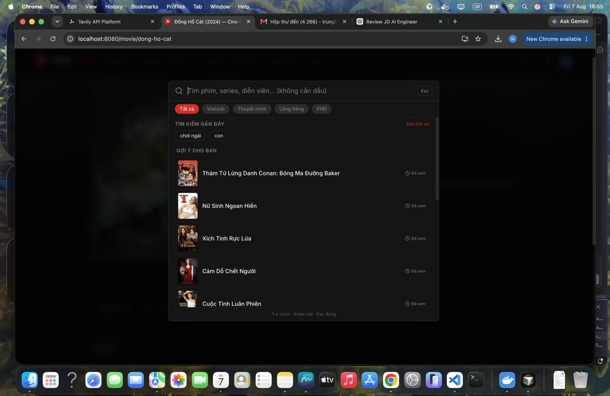
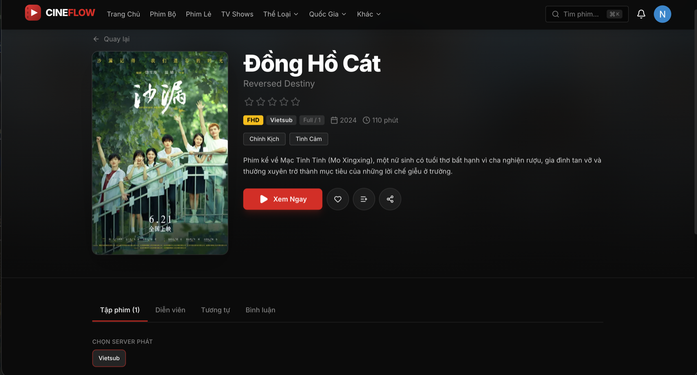
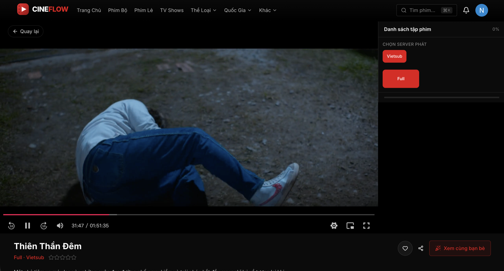

# CineFlow

A Netflix-style movie & series streaming site — browsing, an HLS video player with auto-advance and watch-party, profiles, and an admin dashboard, built on **TanStack Start** (React 19, SSR) and Vietnamese movie catalogs served through [movie-aggregator-api](../movie-aggregator-api).

---

## Highlights

**Browsing & discovery**

- Home page with an auto-rotating hero carousel, a Top 10 trending board (podium + ranked list), continue-watching row, and catalog rows by type.
- Catalog, genre, country, and year listing pages with filters and pagination.
- Global search with debounced suggestions, recent/quick filters, and a command-style modal (`⌘K`).
- SEO: per-route meta tags, JSON-LD (`VideoObject`, `BreadcrumbList`), `sitemap.xml`, i18n `hreflang`.

**Playback**

- Custom HLS.js player: adaptive quality levels, subtitle tracks, 0.5x–2x speed, Picture-in-Picture, fullscreen, keyboard shortcuts (space/arrows/M/F/N), resume-from-last-position.
- Multi-server failover per episode (auto-retries an alternate upstream server on error) and an iframe/embed fallback player for sources with no direct `.m3u8`.
- Auto-advance to the next episode with a 5s countdown overlay (cancelable).
- "Watch trailer" button + modal (YouTube) on the home hero and movie detail page.

**Watch Party**

- Create/join a synced room by code or PIN; playback position, pause/seek, and reactions are synced over Socket.IO.
- In-room chat, member list, host controls, and a mobile-optimized layout.

**Account & social**

- Supabase-backed auth (email/password + Google OAuth), password reset.
- Favorites, watchlists (multiple named lists), watch history with resume, per-movie/episode ratings and comments.
- Profile page with activity feed and watch stats; in-app notification bell for new episodes on tracked series.
- Demo "Premium" plan gating ad-skip and longer watch-party sessions.

**Admin dashboard**

- Traffic/analytics charts (recharts): hourly traffic, page types, search terms, movie view/episode/server stats.
- User role management, comment moderation, and watch-party room oversight.

**i18n** — Vietnamese/English via `i18next`, with locale-aware dates and number formats.

---

## Demo

| Global search (`⌘K`)                   | Movie detail                                       | Player                                 |
| -------------------------------------- | -------------------------------------------------- | -------------------------------------- |
|  |  |  |

---

## Tech stack

**TanStack Start** (React 19, SSR + file-based `TanStack Router`) · **TanStack Query** (+ persisted cache) · **Zustand** · **Tailwind CSS 4** + shadcn/ui (Radix primitives) · **Framer Motion** · **HLS.js** · **Socket.IO client** · **i18next** · **Zod** · **Axios** · **Recharts** · **Vite**

Deployable to either Vercel or Cloudflare Workers (both `vercel.json` and `wrangler.jsonc` are included).

---

## Architecture

```
Browser
  │
  ▼
CineFlow (TanStack Start, SSR)  ──HTTP──►  movie-aggregator-api  ──►  KKPhim / OPhim / VSMOV
  │                                              │
  ├──Socket.IO──► Watch Party rooms              └──►  Supabase (auth, favorites, history, comments, ...)
  │
  └── TanStack Query cache (persisted to localStorage)
```

All data — movies, auth, favorites, watchlists, history, ratings, comments, watch-party, analytics — goes through a single backend, `movie-aggregator-api`; the frontend holds no direct Supabase client.

---

## Project structure

```
src/
├── routes/              # file-based routes (TanStack Router)
│   ├── index.tsx, movie.$slug.tsx, watch.$slug.tsx, search.tsx, ...
│   ├── admin.*.tsx      # analytics, users, comments, rooms, movies, dashboard
│   └── watch-party.$code.tsx
├── components/
│   ├── movie/           # cards, hero, detail tabs, ranking board, trailer modal
│   ├── player/           # video player, controls, episode list, next-episode overlay
│   ├── watchparty/       # room view, chat, sync, reactions
│   ├── admin/            # admin layout + charts
│   ├── search/ filters/ layout/ profile/ auth/ notifications/ common/
│   └── ui/               # shadcn/ui primitives actually in use
├── hooks/                # data hooks (useMovies, useFavorites, ...) + player/ admin/ sub-hooks
├── services/             # API clients: movies (aggregator) + platform (auth, favorites, ...)
├── lib/                  # http client, i18n, SEO, watch-party socket/state, HLS ad-skip
├── store/                # zustand stores (auth, player, favorites, watchlist, settings)
├── constants/, types/, utils/, locales/
```

---

## Getting started

```bash
yarn install
cp .env.example .env
# set VITE_MOVIE_API_URL to your running movie-aggregator-api instance
yarn dev
```

Open `http://localhost:5173`. Requires [movie-aggregator-api](../movie-aggregator-api) running (or reachable) for any real data.

---

## Environment variables

| Variable             | Description                                                               |
| -------------------- | ------------------------------------------------------------------------- |
| `VITE_MOVIE_API_URL` | Base URL of `movie-aggregator-api` (defaults to a built-in URL if unset). |
| `VITE_SITE_URL`      | Public site URL used for SEO tags, canonical links, and the sitemap.      |

---

## Scripts

| Command               | Description                                                                          |
| --------------------- | ------------------------------------------------------------------------------------ |
| `yarn dev`            | Dev server with HMR                                                                  |
| `yarn build`          | Production build                                                                     |
| `yarn preview`        | Preview the production build locally                                                 |
| `yarn lint`           | ESLint                                                                               |
| `yarn format`         | Prettier write                                                                       |
| `yarn test`           | Unit tests (auth routes/token, watch progress, local history, watch-party sync math) |
| `yarn check:contract` | Validate the frontend's expected API shape against the live backend                  |
